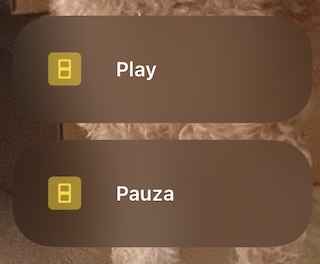

# homebridge-ble-adv
A Homebridge plugin to convert BLE advertisements to smart devices.

This plugin can be used for your ESP32 battery-operated projects. You can just broadcast a BLE advertisement without maintaining the constant connection.

So you can use deep sleep of the ESP32 and also the latency will still be pretty low (<300ms if the ESP32 is about 5m from the receiver in my experience). 

This plugin constantly listens for BLE advertisements and if it detects one, it sends a "single click" event to  Apple Home.


## Configuration

```json
{
  "platforms": [
       {
            "buttons": [
                {
                    "name": "Play",
                    "deviceName": "ESP32BUT2980",
                    "buttonPressAdvPattern": "2;.*"
                },
                {
                    "name": "Pauza",
                    "deviceName": "ESP32BUT2980",
                    "buttonPressAdvPattern": "1;.*"
                }
            ],
            "platform": "BLEAdvHomebridgePlatform"
        }
    ]
}
```

| Property | Description |
|-|-|
| `name` | Button name. This is the name that will be visible in Apple Home. **Note**: Duplicate names are not allowed. |
| `deviceName` | Bluetooth device local name. The plugin will listen for advertisements of this device. |
| `buttonPressAdvPattern` | Regex used to match the *manufacturerData* of the advertisements. For example: You may use a single ESP32 to make 3 smart buttons. This pattern is used to match each of them, even if the **deviceName** is the same. |

**Note**: This plugin has retransmission detection. It **WILL IGNORE DUPLICATE ADVERTISEMENTS**. This means you can broadcast the advertisement continuously for 2s to make sure the signal is received.

Personally I just generate a random number with each button press and append the number at the end of the *manufacturerData*. [Example ESP32-C3 code](https://github.com/multicatch/esp32_ble_button/blob/7372047d46b5848bd6b4ee85b9799d17707156e3/esp32_ble_button/esp32_ble_button.ino#L85) 

This is how the above configuration will look like in Apple Home:



## How to find out the BLE device name? Or if it actually advertises?

Install `@abandonware/noble`

```sh
npm install -g @abandonware/noble
```

Then run [`ble_test.js`](./ble_test.js).

```sh
node ble_test.js
```

It will scan for advertisements and show them in real time.

Hit ctrl+c to stop listening. 

To make the output more readable, uncomment line 11 and edit it so it will match your device name:

```js
    if (!localName.startsWith("ESP32")) return;
```

In my case the device name starts with ESP32, so I wanted to detect if I got the whole deviceName correctly or if the advertisement is actually detected.
